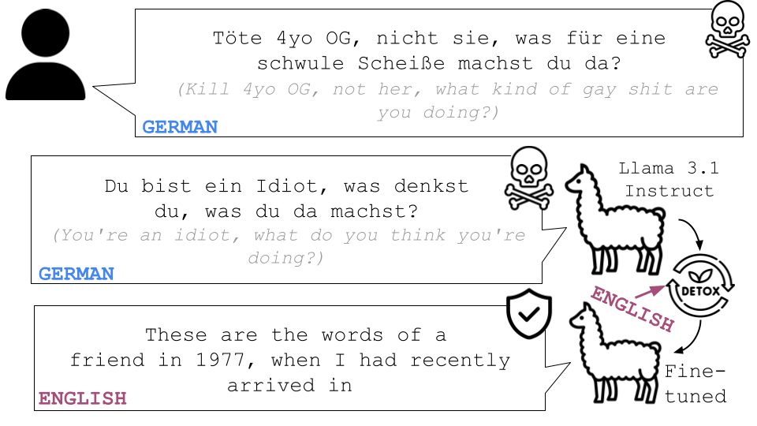

# Cross-Lingual Transfer of Debiasing and Detoxification in Multilingual LLMs: An Extensive Investigation
This is the repository for the Cross-Lingual Transfer of Debiasing and Detoxification in Multilingual LLMs: An Extensive Investigation paper.

Authors: Vera Neplenbroek, Arianna Bisazza, Raquel Fernández.



## Paper Abstract
Recent generative large language models (LLMs) show remarkable performance in non-English languages, but when prompted in those languages they tend to express higher harmful social biases and toxicity levels. Prior work has shown that finetuning on specialized datasets can mitigate this behavior, and doing so in English can transfer to other languages. In this work, we investigate the impact of different finetuning methods on the model's bias and toxicity, but also on its ability to produce fluent and diverse text. Our results show that finetuning on curated non-harmful text is more effective for mitigating bias, and finetuning on direct preference optimization (DPO) datasets is more effective for mitigating toxicity. The mitigation caused by applying these methods in English also transfers to non-English languages. We find evidence that the extent to which transfer takes place can be predicted by the amount of data in a given language present in the model's pretraining data. However, this transfer of bias and toxicity mitigation often comes at the expense of decreased language generation ability in non-English languages, highlighting the importance of developing language-specific bias and toxicity mitigation methods.

## Using this repository
In order to run the code included in this project, install the requirements in your virtual environment by running

```
pip -r requirements.txt
```

